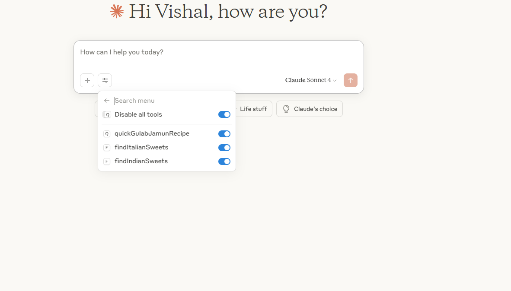
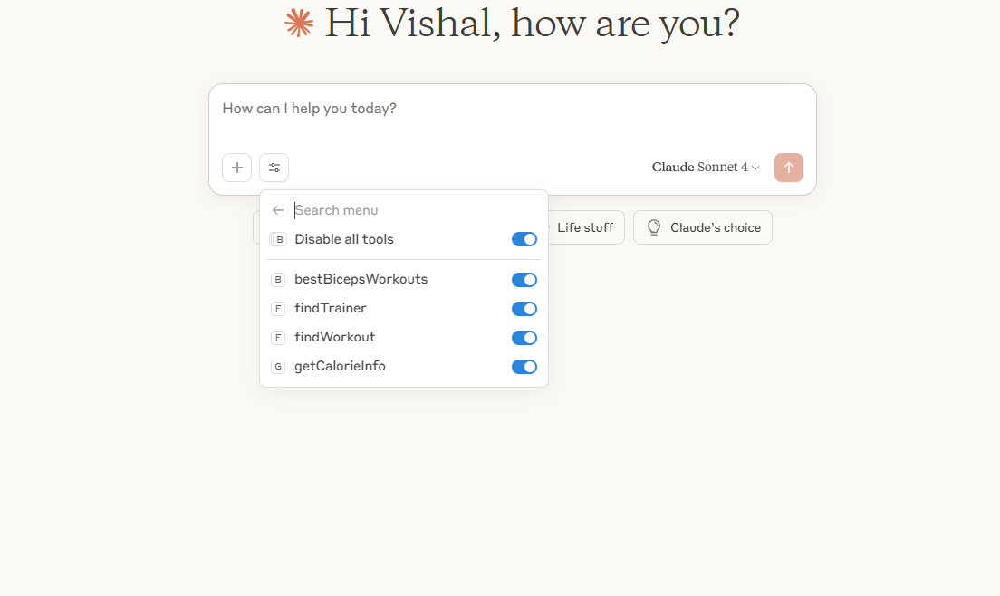
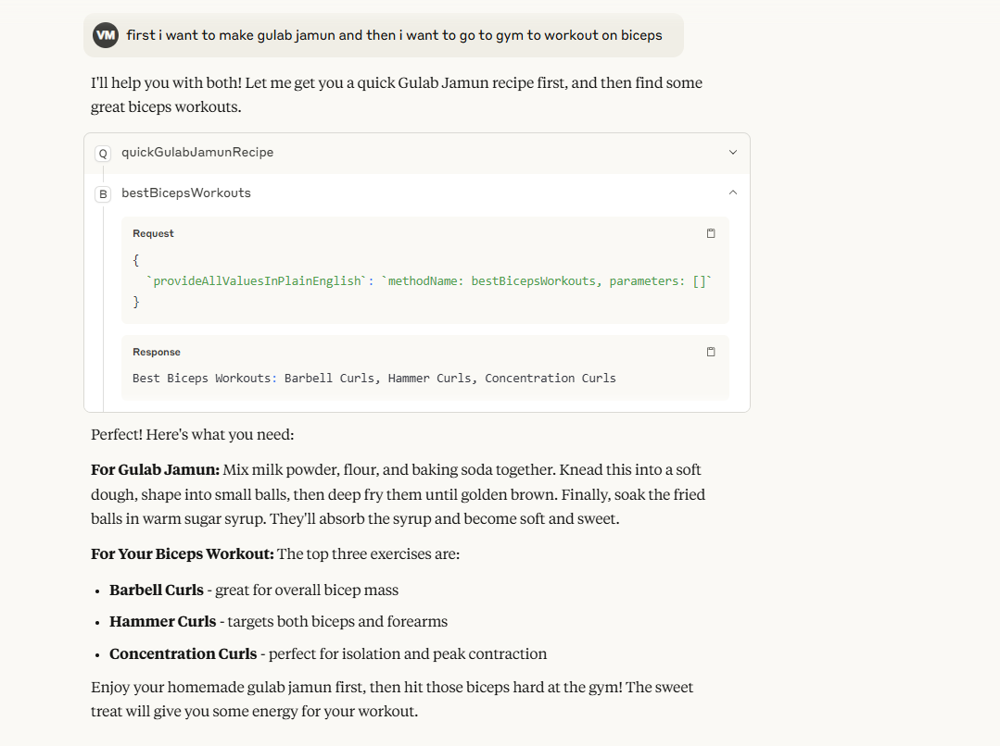

# Multi-Server MCP and A2A Implementation
This project demonstrates how to use agentic Mesh across 4 different servers for MCP and A2A protocols. Each server is responsible for a specific domain and can be queried independently or in combination with others.
It has a multi-server architecture using the Model Context Protocol (MCP) and Agent-to-Agent (A2A) communication protocols. It is designed to handle various domains such as dessert, gym, restaurant, and yoga services.

Implements four separate servers:
1. Dessert Server (Port 7863)
2. Gym Server (Port 7864) 
3. Restaurant Server (Port 7865)
4. Yoga Server (Port 7866)

## Starting the Servers

### Dessert Server
To start the Dessert server, run:
```bash
mvn spring-boot:run -Pdessert 
```

The Dessert server's application properties:
```properties
spring.application.name=dessert-server
server.port=7863
a2a.persistence=cache
tools4ai.properties.path=tools4ai_dessert.properties
```

The Dessert server will start on port 7863: http://localhost:7863

### Gym Server
To start the Gym server, run:
```bash
mvn spring-boot:run -Pgym 
```

The Gym server's application properties:
```properties
spring.application.name=gym-server
server.port=7864
a2a.persistence=cache
tools4ai.properties.path=tools4ai_gym.properties
```

The Gym server will start on port 7864: http://localhost:7864

### Restaurant Server
To start the Restaurant server, run:
```bash
mvn spring-boot:run -Prestaurant
```

The Restaurant server's application properties:
```properties
spring.application.name=restaurant-server
server.port=7865
a2a.persistence=cache
tools4ai.properties.path=tools4ai_restaurant.properties
```

The Restaurant server will start on port 7865: http://localhost:7865

### Yoga Server
To start the Yoga server, run:
```bash
mvn spring-boot:run -Pyoga 
```

The Yoga server's application properties:
```properties
spring.application.name=yoga-server
server.port=7866
a2a.persistence=cache
tools4ai.properties.path=tools4ai_yoga.properties
```

The Yoga server will start on port 7866: http://localhost:7866

Each server has its own tools4ai properties file with a separate action.packages.to.scan:
```properties
# Dessert Server
action.packages.to.scan=org.example.desert

# Gym Server
action.packages.to.scan=org.example.gym

# Restaurant Server
action.packages.to.scan=org.example.restaurant

# Yoga Server
action.packages.to.scan=org.example.yoga
```

## MCP Server and Client Example

This server is designed to work as both an A2A (Agent-to-Agent) and MCP (Model Context Protocol) server:
- A2A: Google's Agent-to-Agent protocol for communication between AI agents
- MCP: Model Context Protocol for interaction with AI models and tools





### Testing with curl commands

You can use curl commands to test all servers. Each server has its own set of services and runs on different ports:
- Dessert Server (Port 7863): Provides dessert-related actions through `DessertService`
- Gym Server (Port 7864): Provides gym-related actions through `GymService`
- Restaurant Server (Port 7865): Provides restaurant-related actions through `RestaurantService`
- Yoga Server (Port 7866): Provides yoga-related actions through `YogaService`

### Get the list of tools

For Dessert Server (Port 7863):
```bash
curl -H "Content-Type: application/json" `
-d '{"jsonrpc":"2.0","method":"tools/list","params":{},"id":9}' `
http://localhost:7863/
```

For Gym Server (Port 7864):
```bash
curl -H "Content-Type: application/json" `
-d '{"jsonrpc":"2.0","method":"tools/list","params":{},"id":9}' `
http://localhost:7864/
```

For Restaurant Server (Port 7865):
```bash
curl -H "Content-Type: application/json" `
-d '{"jsonrpc":"2.0","method":"tools/list","params":{},"id":9}' `
http://localhost:7865/
```

For Yoga Server (Port 7866):
```bash
curl -H "Content-Type: application/json" `
-d '{"jsonrpc":"2.0","method":"tools/list","params":{},"id":9}' `
http://localhost:7866/
```

### Call tools examples

Example: Call a dessert-related tool (Port 7863):
```bash
curl -H "Content-Type: application/json" `
-d '{
"jsonrpc": "2.0",
"method": "tools/call",
"params": {
"name": "findIndianSweets",
"arguments": {
"provideAllValuesInPlainEnglish": {}
}
},
"id": 25
}' `
http://localhost:7863/
```

Example: Call a yoga-related tool (Port 7866):
```bash
curl -H "Content-Type: application/json" `
-d '{
"jsonrpc": "2.0",
"method": "tools/call",
"params": {
"name": "getBeginnerPoses",
"arguments": {
"provideAllValuesInPlainEnglish": {}
}
},
"id": 25
}' `
http://localhost:7866/
```

Note: Make sure you're using the correct port number for the server you want to interact with.

## Connect to Claude Desktop
Configure Claude Desktop Client by locating your Claude configuration file:

```json
C:\Users\<yourusername>\AppData\Roaming\Claude\claude_desktop_config.json
```

Add any of the servers to your configuration. For example, to add the Yoga server:

```json
{
"mcpServers": {
"yogaserver": {
"command": "java",
"args": [
"-jar",
"PATH_TO_YOUR_JAR/mcp-connector-full.jar",
"http://localhost:7866"
],
"timeout": 30000
}
}
}
```

You can download the `mcp-connector-full.jar` from [here](https://github.com/vishalmysore/mcp-connector/releases/download/release2/mcp-connector-full.jar).
This is a mandatory component that enables communication between your client and server for MCP protocol. For A2A this is not required.

## Mesh Client
AgentCatalog is a class that allows you to connect to multiple servers and process queries across them. The example below demonstrates how to use the AgentCatalog to query dessert-related information.
You can cmombine it with AgenticMesh which will allow you to connect to multiple servers and process queries across them either in pipeline or in parallel.

```  
@Log
public class MeshClient {
    public static void main(String[] args) {
        AgentCatalog agentCatalog = new AgentCatalog();
        agentCatalog.addAgent("http://localhost:7862/");
        agentCatalog.addAgent("http://localhost:7863/");
        String answer = agentCatalog.processQuery("what is the receipe for Gulab Jamun").getTextResult();
        log.info("Answer: " + answer);
    }
}
```